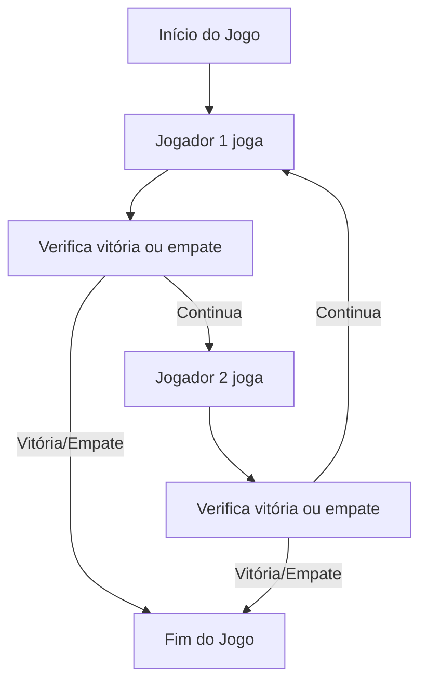

---

### ◼️ Fluxo previsto para o jogo

```mermaid 
  graph TD
      A[Início do Jogo] --> B[Jogador 1 joga]
      B --> C[Verifica vitória ou empate]
      C -->|Vitória/Empate| F[Fim do Jogo]
      C -->|Continua| D[Jogador 2 joga]
      D --> E[Verifica vitória ou empate]
      E -->|Vitória/Empate| F
      E -->|Continua| B
``` 
