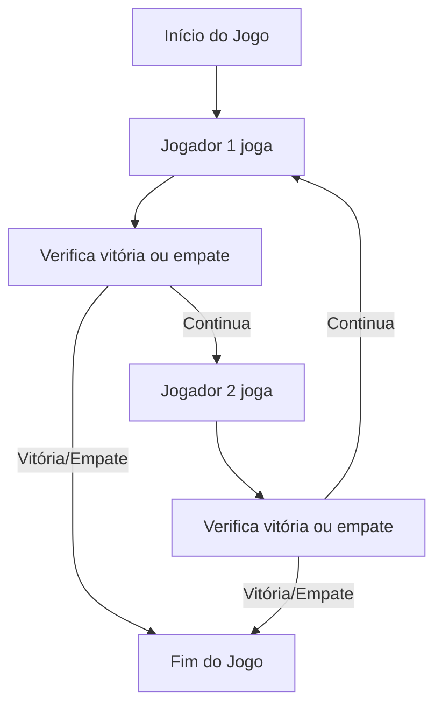

# 🎯 Jogo da Velha (Tic Tac Toe)
> IFPB/JP – TSI – Programação Orientada a Objetos (Prof. Fausto Ayres). Projeto 1.
## Discentes Responsáveis pelo Projeto
- Clara Brito P. N. Alcântara - clara.alcantara@academico.ifpb.edu.br
- Davi César M. Leite - davi.cesar@academico.ifpb.edu.br

## ➡️ Visão Geral da Estrutura da Classe JogoDaVelha (em construção: 🚧)
| Arquivo / Classe             | Descrição                                                                                  |
|-----------------------------|--------------------------------------------------------------------------------------------|
| **JogoDaVelha.java**          | Classe principal que controla o fluxo do jogo, tabuleiro, símbolos, jogadas e resultado     |
| **atributos privados**        | `celulas[]` armazena os valores das posições do tabuleiro (9)                    |
|                             | `simbolos[]` símbolos dos jogadores ('X' && 'O')                                              |
|                             | `historico` histórico das jogadas realizadas (posição, símbolo)                          |
|                             | `quantidadeJogadas` contador de jogadas feitas                                           |
|                             | `contraMaquina` indica se o jogo é contra a máquina                                      |
|                             | `nivelEsperteza` nível de dificuldade da máquina (1 || 2)                                |
| **construtores**              | `JogoDaVelha(String simbolo1, String simbolo2)` inicializa jogo para 2 jogadores          |
|                             | `JogoDaVelha(String nomeJogador1, int nivel)` inicializa jogo contra máquina com nível    |
| **métodos públicos**          | `jogaJogador(int numeroJogador, int posicao)` valida e efetua a jogada do jogador        |
|                             | `jogaMaquina()` define a jogada da máquina                                               |
|                             | `terminou()` verifica se o jogo acabou (vitória ou empate)                              |
|                             | `getResultado()` retorna o estado final do jogo (-1 ativo, 0 empate, 1 ou 2 vitória)     |
|                             | `getSimbolo(int numeroJogador)` retorna símbolo do jogador                               |
|                             | `getFoto()` retorna o tabuleiro como string 3x3                                         |
|                             | `getPosicoesDisponiveis()` lista posições livres no tabuleiro                            |
|                             | `getHistorico()` retorna o histórico das jogadas feitas                                 |

## ➡️ Fluxo previsto para o jogo

